# Retention_IA_Platform_Frontend

 |

 


##  Présentation du projet
**RetentionAI** est une interface web moderne destinée aux directions des Ressources Humaines. Elle permet d'anticiper les départs volontaires des collaborateurs en s'appuyant sur des modèles de Machine Learning et de générer des plans de rétention grâce à l'Intelligence Artificielle.

##  Fonctionnalités clés
*   **Authentification RH** : Accès sécurisé via JWT (Login/Logout).
*   **Saisie de Profil Employé** : Formulaire complet regroupant les indicateurs clés (satisfaction, ancienneté, charge de travail, salaire, etc.).
*   **Tableau de bord de Prédiction** : 
    *   Visualisation du score de risque de démission (probabilité en %).
    *   Indicateur visuel de criticité (Faible, Moyen, Élevé).
*   **IA Générative** : Affichage automatique d'un plan de rétention personnalisé si le risque est détecté comme élevé.

## Stack Technique
*   **Framework** : React.js (Vite)
*   **Langage** : JavaScript (ES6+)
*   **Style** : Tailwind CSS (Responsive Design)
*   **Gestion d'état** : React Context API
*   **Navigation** : React Router 6
*   **Client API** : Axios
*   **Icônes** : Lucide React

## Workflow de l'application

```mermaid
sequenceDiagram
    participant U as Utilisateur RH (Frontend)
    participant B as Backend (FastAPI)
    participant DB as Base de Données (PostgreSQL)
    participant ML as ML Pipeline (Local)
    participant G as Google Gemini (GenAI)

    Note over U,B: Authentification requise (JWT)

    %% Étape 1 : Inscription / Connexion
    U->>B: POST /register ou /login
    activate B
    B->>DB: Vérification / Création User
    DB-->>B: Retour User
    B-->>U: JWT Token
    deactivate B

    %% Étape 2 : Prédiction churn
    U->>B: POST /predict (données employé)
    activate B
    B->>B: Validation Token & Input
    B->>ML: Calcul churn probability
    ML-->>B: Probabilité de churn
    B-->>U: % de risque
    deactivate B

    %% Étape 3 : Génération plan de rétention
    alt Risque > 50%
        U->>B: POST /generate-retention-plan
        activate B
        B->>G: Génération plan avec Gemini
        G-->>B: Retour 3 actions concrètes
        B-->>U: JSON {Actions de rétention}
        deactivate B
    else Risque ≤ 50%
        Note over B,U: Pas d'action générée
    end
```



## 🚀 Installation

### Prérequis
*   Node.js (v18+)
*   npm 

### Étapes d'installation
1. **Cloner le projet**
```bash
   git clone https://github.com/khadija199904/Retention_IA_Platform_Frontend.git
   cd Retention_IA_Platform_Frontend
```
2. **Installez les dépendances npm**
    ```sh
    npm install
    ```
### 2.  Lancer le projet avec Docker
 - Ouvrez votre terminal à la racine du projet.
 - Lancez la construction et le démarrage :
 ```bash
 docker-compose up --build
 ```
### 3. Accédez à l'application :
      - Frontend : http://localhost:5173
      - Backend Swagger : http://localhost:8000/docs
### 4. Connexion à la base PostgreSQL dans Docker : 
   - Accéder au container PostgreSQL :
```bash
   docker-compose exec db psql -U postgres -d Retention_db
```
  - Lister les tables existantes :
```bash
   \dt
```
 - Afficher le contenu de la table users :
```bash
   SELECT * FROM public."users";
```
- Afficher le contenu de la table predictions_history :
```bash
   SELECT * FROM public."predictions_history";
```
## 5. Gestion des Erreurs Frontend
L'interface gère les codes erreurs renvoyés par le backend :
```bash
  Code   Signification
  ------ -----------------------
  401    Non authentifié
  422    Texte vide ou invalide
  500    Erreur interne serveur
  503    Serveur en surcharge
```

## 6. Structure du projet (Frontend)

```bash

Retention_RH_Platform_Frontend/
├── retentionRH-app/
│   ├── src/
│   │   ├── assets/              # Logos, images, polices, icônes 
│   │   │
│   │   ├── components/          # Composants UI atomiques et réutilisables
│   │   │   ├── EmployeeForm/         
│   │   │   └── Logoutbutton/            
│   │   │
│   │   │
│   │   ├── pages/               # Pages complètes (vues)
│   │   │   ├── auth/
│   │   │   │   ├── Login.jsx
│   │   │   │   ├── Register.jsx
│   │   │   │   ├── auth.jsx
│   │   │   │   └── Auth.css
│   │   │   └── generate/
│   │   │       ├── Generate.jsx
│   │   │       └── Generate.css
│   │   │
│   │   ├── App.jsx              # Routing et Providers
│   │   ├── main.jsx             # Point d'entrée
│   │   └── index.css            # Styles globaux (CSS)
│   │
│   ├── Dockerfile
│   ├── package.json
│   └── vite.config.js
└── README.md


```